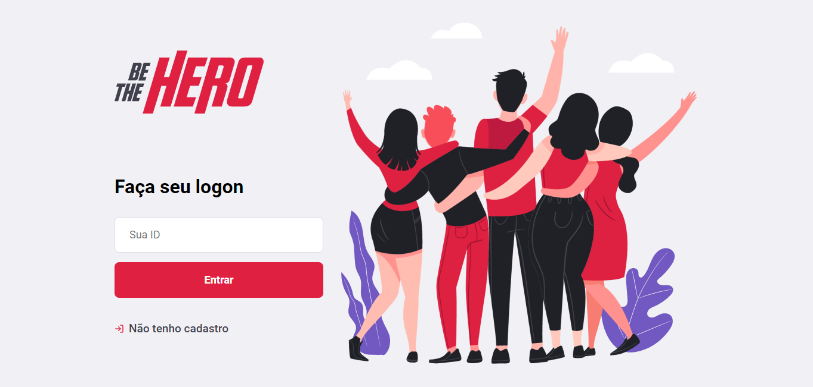
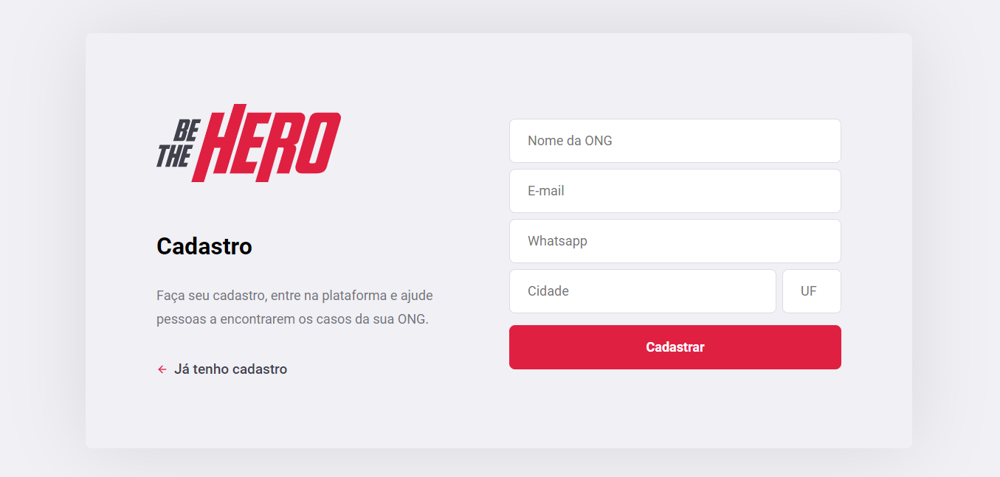
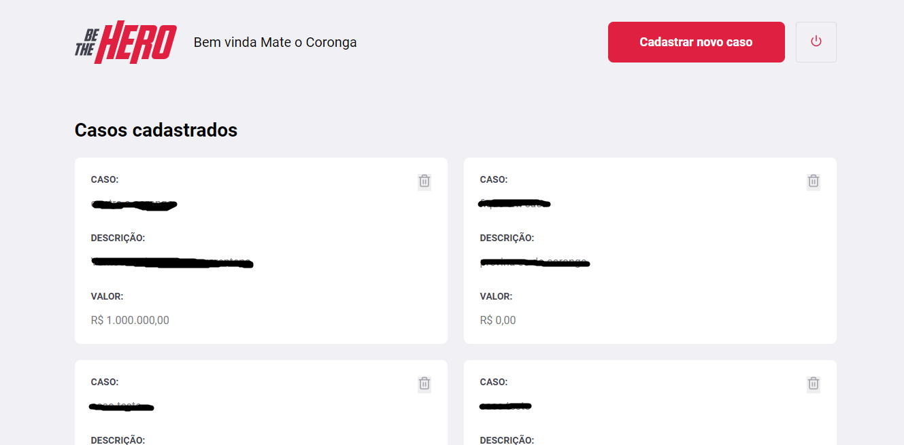
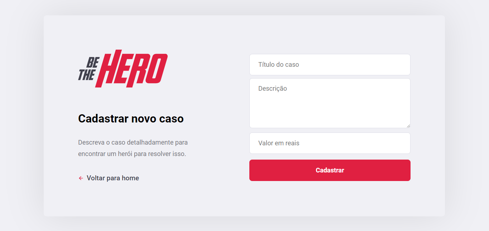
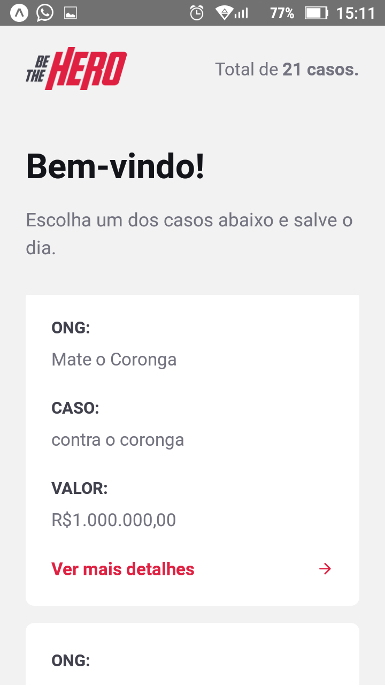
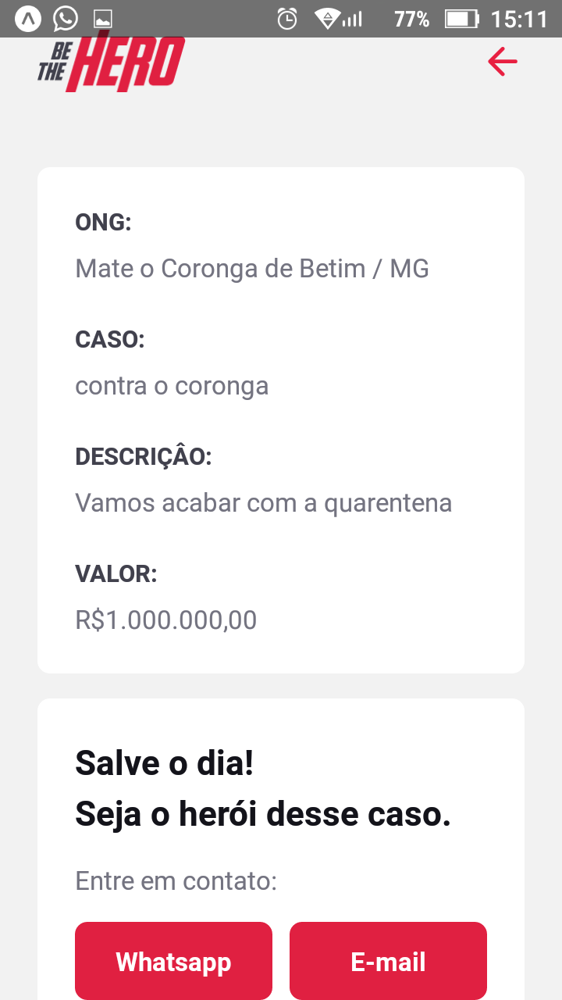

#be-the-hero

#Portugues

Projeto de estudo da Semana Omnistack 11 usando Nodejs, React Js e React Native.

O projeto se baseia em uma aplicação afim de encontrar ONGs que necessitam de ajuda financeira para a realização de seus serviços.

A aplicação faz a listagem dos casos, quais ONGs eles pertecem e o valor necessário para a realização.

#English

Omnistack 11 Week study project using Nodejs, React Js and React Native.

The project is based on an application to find NGOs that use financial aid to carry out their services.

The application makes a list of cases, which NGOs they belong to and the amount needed to carry them out.

#Partes da Aplicação

A aplicação é composta por três partes, um server side utilizando uma api RESTful, e dois interfaces, uma 

web para cadastro e gerenciamento de Ongs e uma mobile para clientes acessarem os casos cadastrados.

Imagens:

Interface Web utilizando React JS.

Interface Mobile utilizando React Native

